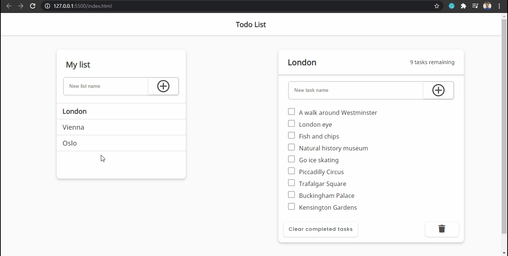

    <h1>Todo List</h1>

    

---

## About
This is a simple todo list page that I've learned on Youtube.

## Technologies
- [HTML5](https://developer.mozilla.org/pt-BR/docs/Web/HTML/HTML5)
- [CSS3](https://developer.mozilla.org/pt-BR/docs/Web/CSS)
- [JavaScript](https://developer.mozilla.org/pt-BR/docs/Web/JavaScript)

Developed by - Renato Souza
